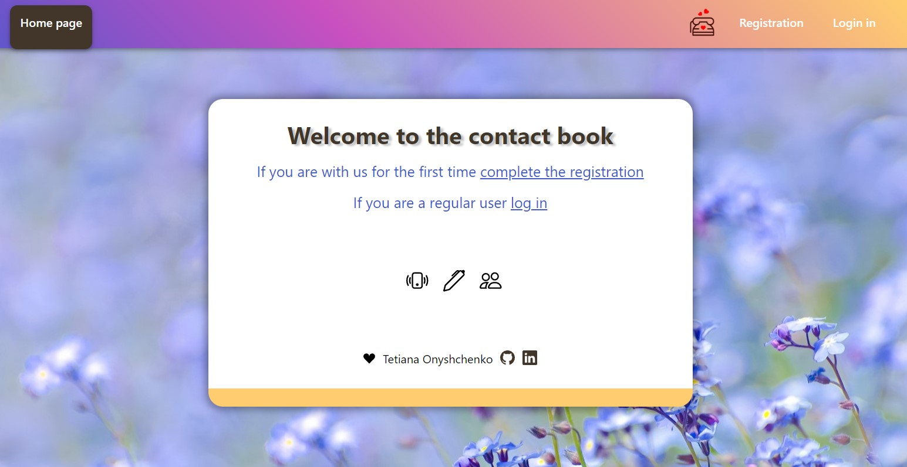
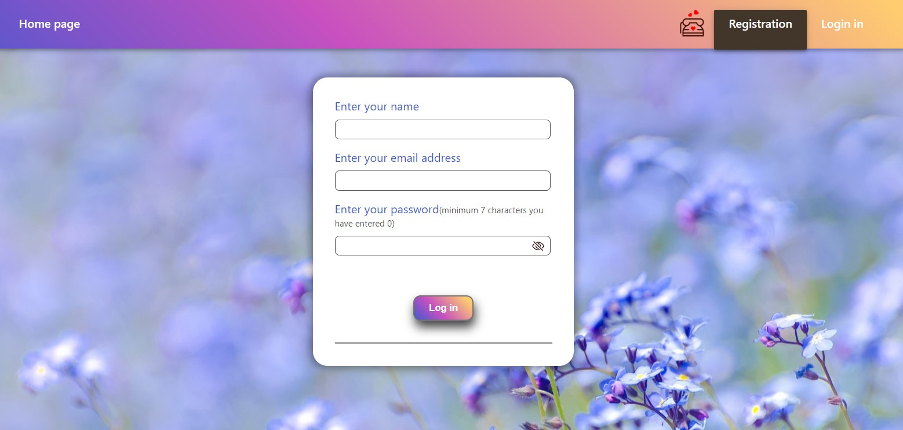
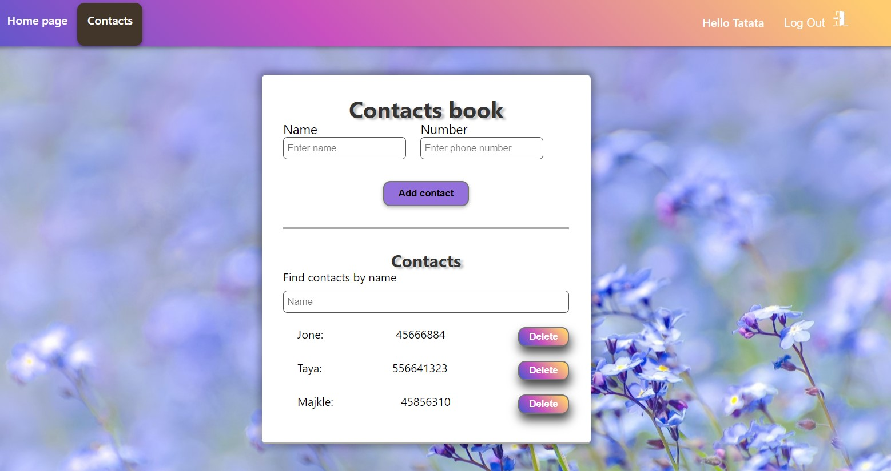

# My contact book

Phonebook - is an application that allows you to maintain an online phone book.
To enter the application, user registration is required.

After registration, you can add and remove contacts. There is also a system for
searching for contacts in already added ones.

Backend. There is a ready-made backend for this task. Backend created with the
service mockapi.io.

Routing routing with the React Router library. The application have several
pages:

/register - public route to register a new user with a form /login - public
login route of an existing user with a form /contacts - a private route for your
contact list Add a navigation component Navigation with links to navigate
routes.

User menu a component UserMenu, that displays the user's email and a logout
button.

## Getting Started

To get started with our Drive Ukraine Now, follow these steps:

1. Clone this repository to your local machine.
2. Install the necessary dependencies by running `npm install`.
3. Start the application with `npm start`.

## Link to the app

To use the application, please follow the link
[Phonebook App](https://tetiana892.github.io/Phonebook/).

<b>Technologies and tools used in development:</b> 

 

 

## Contact

If you have any questions, suggestions, or need assistance, feel free to contact
our support team at tatina892@gmail.com.

<b>Thank you very much for choosing  application!</b>
  

